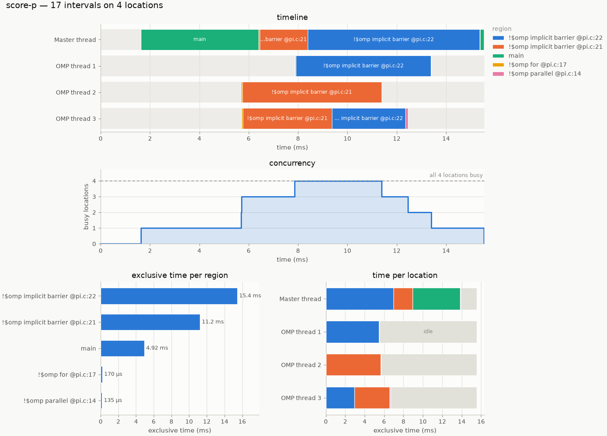

# otf2viz

Matplotlib visualisation of OTF2 parallel traces — the ones Score-P writes when
you build with `scorep` and run with tracing on. Reads the trace into a
filterable table of region intervals and draws it: a timeline per thread,
concurrency over time, and where the time actually went.

Every figure is a plain Matplotlib figure. It renders inline in Jupyter, saves
to PNG/SVG/PDF, and drops into your own subplot grid.

```python
import otf2viz

trace = otf2viz.read_trace("openmp/02_pi/score-p")
otf2viz.overview(trace)
```



## Install

```sh
pip install -e .
```

```sh
source ~/venvs/scorep/bin/activate
python -c "import otf2; print(otf2.__version__)"
```

Everything except `read_trace()` works without them, so you can develop plots
against `Trace.from_events(...)` anywhere.

Optional extras: `pip install -e '.[jupyter]'` for the interactive widget,
`'.[pandas]'` for `to_dataframe()`, `'.[dev]'` for the tests.

## Reading a trace

`read_trace()` takes the `traces.otf2` anchor file or any directory holding
one, so a Score-P experiment directory works directly:

```python
trace = otf2viz.read_trace("scorep-20250904_2031_110671047732461")
trace                       # rich summary in Jupyter, repr elsewhere
# <Trace 'score-p': 17 intervals, 4 locations, 5 regions, 15.5 ms>

otf2viz.find_traces("runs/")    # every traces.otf2 under a directory
```

Reading is one pass per location, so it parallelises. `workers=None` (the
default) reads serially for small traces and spreads over the CPUs for large
ones; `workers=1` forces serial.

All times are **seconds relative to the start of the measurement**. Enter/Leave
pairs become intervals with their call-stack depth, and the time spent in
nested regions is recorded so exclusive timings are exact.

## The trace table

A `Trace` is parallel NumPy arrays plus the definitions they index — `start`,
`stop`, `location`, `region`, `depth`, `child_time`:

```python
len(trace)                    # number of intervals
trace.duration                # seconds
trace.locations               # threads / ranks, in file order
trace.region_stats()          # per region: count, inclusive, exclusive, mean, max
trace.location_stats()        # per location: busy, idle, utilisation
trace.concurrency()           # (times, counts) step function
trace.to_dict()               # plain columns
trace.to_dataframe()          # pandas, if installed
```

### Filtering

Filtering is how you make a big trace readable. `filter()` returns a new trace
and never mutates the original:

```python
import re

trace.filter(regions="main")                      # exact name
trace.filter(regions=["main", "compute"])         # several names
trace.filter(regions=re.compile(r"^!\$omp"))      # a pattern
trace.filter(regions=lambda r: r.begin_line == 17)  # a predicate

trace.filter(exclude_roles=["IMPLICIT_BARRIER"])  # drop OpenMP barriers
trace.filter(paradigms="MPI")                     # only MPI regions
trace.filter(max_depth=1)                         # strip nested detail
trace.filter(min_duration=1e-5)                   # drop the noise
trace.filter(locations=["P0 Master thread"])      # some rows only

trace.select_time(0.10, 0.13)                     # zoom into a window
trace.select_time(0.10, 0.13, clip=True)          # ...and cut the stragglers
```

Regions that end up unused are pruned, so they do not pad the legend.
Locations are **not** — a thread that goes idle under a filter stays as an
empty row, which is usually the thing you wanted to see.

## The plots

| Function | Question it answers |
|---|---|
| `timeline(trace)` | What was each thread doing, when? |
| `concurrency(trace)` | How many threads were busy at once? |
| `region_summary(trace)` | Which region cost the most time? |
| `location_breakdown(trace)` | Is the load balanced across threads? |
| `overview(trace)` | All four, sharing one x axis and one palette |

### Saving to a file

Every plot takes `save=`, and the file extension picks the format — anything
Matplotlib can write:

```python
otf2viz.timeline(trace, save="timeline.png")
otf2viz.overview(trace, save="report/overview.pdf")
otf2viz.region_summary(trace, save="regions.svg")
```

An extension Matplotlib does not know is an error, not a PNG named `.jpg`. The
file is cropped to what is actually drawn, so the timeline's legend comes out
whole instead of clipped at the figure edge. The plot is still returned, so you
can save *and* keep tweaking. With `ax=` given, `save=` writes that axis' whole
figure, panels and all.

### Timeline

```python
otf2viz.timeline(
    trace.select_time(0, 0.02),
    nesting="overlay",     # or "lanes" (flame graph), "flat" (outermost only)
    color_by="region",     # or "paradigm", "role"
    markers=True,          # thread fork/join carets
)
```

`nesting="overlay"` paints nested regions over their parent — the usual
trace-viewer look. `"lanes"` gives each call depth its own sub-lane, which
turns each thread's row into a flame graph.

Bars wide enough to hold their name get one, placed in the widest part of the
bar that no nested region paints over and measured against that gap, so labels
never collide. That is what lets you read a timeline without hunting through
the legend.

### Consistent colours across plots

Build one `ColorMap` and pass it around. Colour then follows the *region*, not
its rank, so filtering never repaints the series that survive:

```python
colors = otf2viz.ColorMap.from_trace(trace)

fig, (top, bottom) = plt.subplots(2, 1, figsize=(12, 6))
otf2viz.timeline(trace, ax=top, colors=colors)
otf2viz.timeline(trace.select_time(0.1, 0.2), ax=bottom, colors=colors)
```

Regions past the palette's eight slots fold into a single neutral `other`
bucket rather than getting an invented ninth hue. Raise `max_colors` and the
extra series reuse a hue *plus* a texture, so identity is never colour alone.
Grouping by `color_by="paradigm"` or `"role"` usually fits without folding and
is a good first look at a busy trace.

### Themes

```python
otf2viz.timeline(trace, theme="dark")   # per plot
otf2viz.set_theme("dark")               # for the session
```

The dark theme is a selected palette — the same eight hues re-stepped for a
dark surface — not an inverted light one.

## In Jupyter

Nothing special is needed; `%matplotlib inline` is the default. A `Trace`
renders as a summary table when it is the last expression in a cell, and the
table views render as HTML:

```python
trace                            # summary
otf2viz.summary(trace)           # the measurement, one fact per row
otf2viz.region_table(trace)      # the numbers behind region_summary
otf2viz.location_table(trace)    # the numbers behind location_breakdown
```

With `ipywidgets` installed there is a windowed explorer — a time-range slider,
a depth cap and a region picker in one row above the plot:

```python
otf2viz.interactive_timeline(trace)
```

See `examples/quickstart.ipynb`.

## Without an OTF2 file

The plots work on any start/stop data. `Trace.from_events()` takes
`(location, region, start, stop)` tuples and recovers the nesting itself:

```python
from otf2viz import Trace, timeline

trace = Trace.from_events([
    ("thread 0", "main",    0.0, 1.0),
    ("thread 0", "compute", 0.1, 0.6),
    ("thread 0", "barrier", 0.6, 1.0),
    ("thread 1", "compute", 0.15, 0.55),
    ("thread 1", "barrier", 0.55, 1.0),
])
timeline(trace)
```

A location may also be a `(process, thread)` pair, which is how you get the
per-process row grouping without a real trace.

## Design notes

* **One measure per axis.** No dual-axis charts; two measures mean two panels.
* **Colour by identity, never by rank.** A filter must not repaint survivors.
* **Never invent a hue.** Eight categorical slots in a fixed order chosen so
  that neighbouring series stay distinguishable under colour-vision
  deficiency; past that, fold or add texture.
* **Every chart has a table.** `region_table` / `location_table` are the exact
  numbers, and the accessible view.
* **Bar length is the comparison** in `region_summary`, so its bars are one
  colour with direct value labels — colouring them by region would encode
  nothing the axis does not already say.

## Tests

```sh
pytest                                              # plots and model, no otf2 needed
OTF2VIZ_TEST_TRACE=path/to/scorep_run pytest        # plus the OTF2 reader
```

## Layout

```
src/otf2viz/
  model.py        Trace, Region, Location — the interval table, filtering, stats
  reader.py       OTF2 -> Trace
  theme.py        the two palettes and their rcParams
  colors.py       ColorMap: key -> (colour, hatch), with the "other" fold
  tables.py       Table, region_table, location_table, summary
  interactive.py  the optional ipywidgets explorer
  plots/
    timeline.py   the Gantt view
    summary.py    region_summary, location_breakdown, concurrency
    overview.py   the combined figure
```
